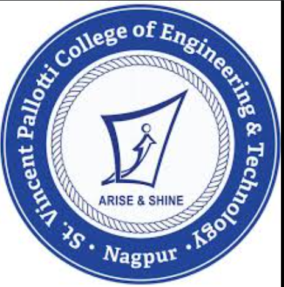
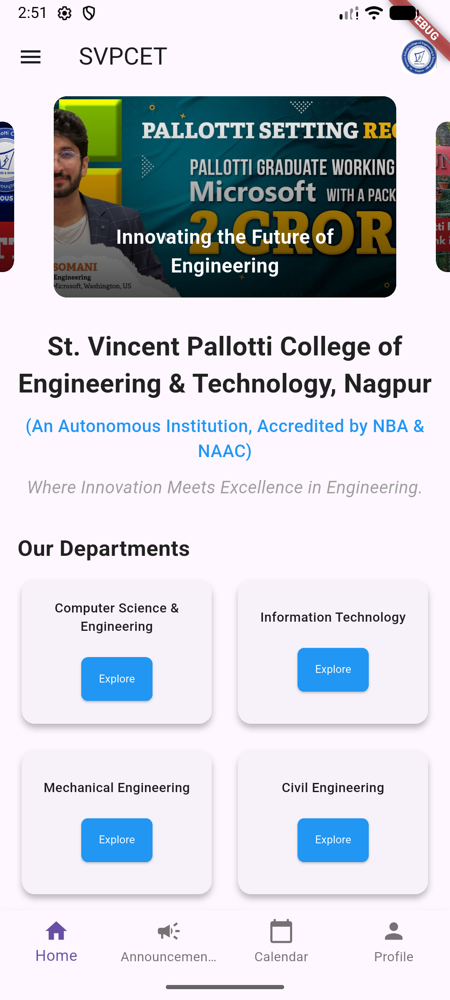
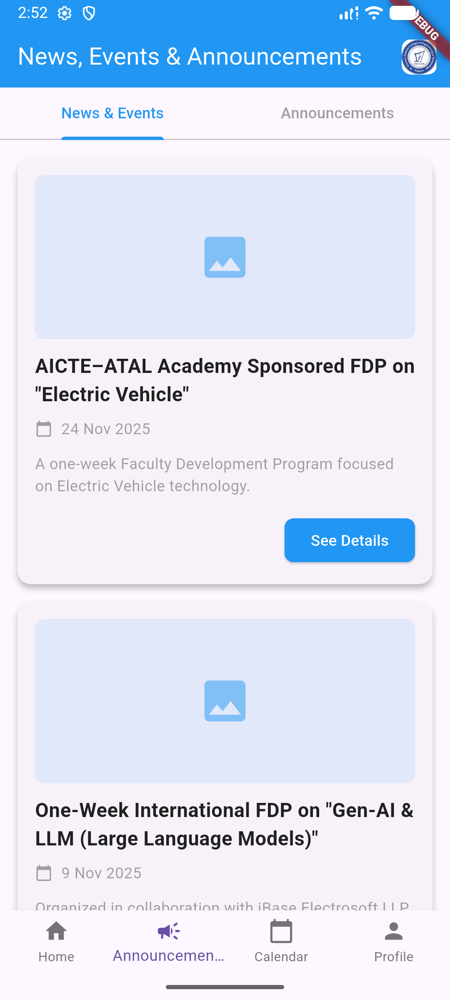
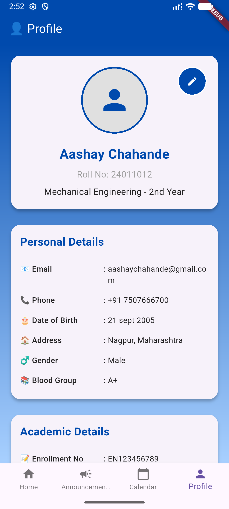

# 🎓 SVPCET Mobile App - St. Vincent Pallotti College of Engineering & Technology

**Your complete digital companion for the St. Vincent Pallotti College of Engineering & Technology campus experience!**

## 🌟 About the App

Welcome to the official mobile application of **St. Vincent Pallotti College of Engineering & Technology (SVPCET)**, Nagpur! This all-in-one platform is designed to enhance your campus experience by providing instant access to all essential college information, services, and resources right at your fingertips.

Whether you're a student, faculty member, or staff, this app streamlines daily tasks and keeps you connected with the SVPCET community.

## 🏫 About St. Vincent Pallotti College of Engineering & Technology

> *"Where Innovation Meets Excellence in Engineering"*

Established in 2004 by the Nagpur Pallottine Society, SVPCET is a premier autonomous engineering institution located in Nagpur, Maharashtra, India. With a strong commitment to academic excellence and holistic development, the college has become a beacon of quality technical education.

### 🏆 Accreditations & Recognitions
- **NAAC Grade 'A'** 
- **NBA Accredited** programs in multiple branches
- **NIRF Listed** institution
- **AICTE Approved** and affiliated to RTM Nagpur University

### 🎯 Vision
To develop a knowledge-based society with clarity of thoughts and charity at hearts to serve humanity with integrity.

### 🎯 Mission
To empower youth to be technocrats of tomorrow with absolute discipline, quest for knowledge and strong ethos to uphold the spirit of professionalism.

## 🚀 Key Features

### 🏠 Home Dashboard
- **Interactive Carousel** showcasing campus highlights
- **Department Overview** with 14+ engineering branches
- **Quick Access** to important college resources
- **Achievements & Accreditations** display
- **Vision & Mission** statements

### 📰 News, Events & Announcements
Stay updated with the latest happenings on campus:
- **Events Calendar** with upcoming activities
- **Important Announcements** from administration
- **Workshops & FDPs** information
- **Cultural & Technical Fest** updates

### 📅 Academic Calendar
- **Semester-wise** academic schedules
- **Toggle between Odd/Even** semesters
- **Exam Timetables** and result dates
- **Holiday Lists** and important dates

### 📚 Academic Resources
Access essential academic materials:
- **Syllabus PDFs** for all programs
- **Time Tables** and schedules
- **Exam Schedules** and guidelines
- **Attendance & Results** portal access

### 🎓 Programs Offered
Comprehensive information about academic offerings:
- **Undergraduate Programs** (B.Tech) - 12 specializations
- **Postgraduate Programs** (M.Tech) - 6 specializations
- **Vocational Programs** (B.Voc & MBA)
- **Ph.D. & Research Programs**

### 🏗️ Departments & Branches
Detailed information about all engineering departments:
- **Computer Science & Engineering** (CSE)
- **Information Technology** (IT)
- **Mechanical Engineering** (ME)
- **Civil Engineering** (CE)
- **Electronics & Telecommunication** (ETC)
- **Electrical Engineering** (EE)
- **Emerging Specializations** (AI, Data Science, Cyber Security, etc.)

### 👤 Profile Section
Personalized user experience (Coming Soon)

## 📱 Screenshots

*Home Dashboard* | *News & Events* | *Academic Calendar*
:-------------------------:|:-------------------------:|:-------------------------:
 |  | 

## 🛠️ Technical Stack

This application is built using cutting-edge technologies:

- **Flutter Framework** - Cross-platform mobile development
- **Dart Programming Language** - Application logic
- **Material Design** - Modern UI components
- **Carousel Slider** - Interactive image galleries

## 🎯 Target Users

- **Students** - Access academic resources, timetables, and campus updates
- **Faculty** - Stay informed about academic schedules and institutional updates
- **Staff** - Keep track of administrative announcements and events
- **Prospective Students** - Learn about programs, departments, and campus life
- **Alumni** - Stay connected with the college community

## 📊 College Highlights

- **10+ Acres** of lush green campus
- **2200+ Students** across various programs
- **150+ Faculty Members** with industry expertise
- **4000+ Alumni** across 53 countries
- **670+ Students** in internships with industry partners
- **100+ Companies** for internship collaborations

## 🎓 Academic Excellence

### Undergraduate Programs (B.Tech)
1. Computer Science & Engineering (CSE)
2. Information Technology (IT)
3. Electronics & Telecommunication Engineering (ETC)
4. Electrical Engineering (EE)
5. Mechanical Engineering (ME)
6. Civil Engineering
7. Artificial Intelligence & Machine Learning
8. Robotics & Artificial Intelligence
9. Industrial Internet of Things
10. Computer Science & Business Systems
11. Cyber Security
12. Data Science

### Postgraduate Programs (M.Tech)
1. Computer Science & Engineering
2. VLSI Design
3. Electrical Power Systems
4. Thermal Engineering
5. Structural Engineering
6. Industrial Engineering

### Specialized Programs
- B.Voc in Software Development
- B.Voc in Automotive Technology
- MBA (Master of Business Administration)
- Ph.D. Research Programs

## 🌐 Contact Information

📍 **Address:**
St. Vincent Pallotti College of Engineering & Technology
Gavsi Manapur, Wardha Road
Nagpur, Maharashtra, India - 441108

📞 **Phone:** +91 7743979315, +91 9423683433
📧 **Email:** info@stvincentngp.edu.in
🌐 **Website:** [www.stvincentngp.edu.in](http://www.stvincentngp.edu.in)

  <strong>Made by The Aashay chahande </strong>

  

